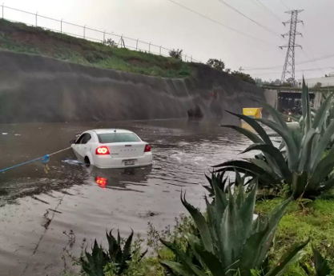

Todos estamos familiarizados con la idea de que el cambio climático implica un aumento en la temperatura y, por consiguiente, olas de calor más intensas en verano. Sin embargo, en realidad se trata de cambios a escala planetaria, como la acidificación del océano, el derretimiento de los glaciares, y cambios en los patrones de precipitación.<!--more-->

Una atmósfera más caliente puede almacenar más vapor de agua y por tanto se espera que la precipitación a nivel global aumente. Los impactos locales podrían ser muy variados debido a los cambiantes patrones de viento, con algunos lugares teniendo un incremento y otros una caída en la precipitación. Otro elemento importante que considerar es la duración en que se acumula la precipitación total: si tenemos una tormenta que dura 6 horas en las que se acumularon 12 mm, la intensidad de precipitación es de 2 mm/hora, y es probable que los sistemas de drenaje urbano sean capaces de evacuar adecuadamente las aguas pluviales. Por el contrario, si la lluvia es más fuerte, digamos que los mismos 12 milímetros cayeron en una tormenta que solo duró 2 horas, la intensidad de precipitación ahora es de 6 mm/hora y si el sistema de drenaje no fue diseñado para tal intensidad de precipitación, es posible que haya inundaciones.

La forma más común en que se forman nubes y la lluvia es que el aire húmedo que está en la superficie se caliente, se vuelva menos denso y ascienda. Al subir en la atmósfera se enfría hasta que la humedad que contiene se condensa y se forman las nubes con pequeñas gotas líquidas suspendidas. El incremento de la temperatura del aire debido al cambio climático hará que este proceso de formación de nubes, que llamamos convección, sea mucho más intenso. Esto es importante porque la intensidad de la lluvia está fuertemente asociada a la convección. En muchos lugares, se espera que la cantidad de lluvia total no cambie significativamente pero que la precipitación caiga ahora en periodos más concentrados: lluvias más cortas e intensas, y temporadas de lluvia menos duraderas y más periodos secos.

Al fenómeno de cambio climático global hay que sumarle el cambio climático local por la isla de calor urbano. Pavimentar calles y talar árboles hace que se atrape más calor en la superficie y que el proceso de convección sea más intenso, lo que aumenta tanto la precipitación acumulada como la intensidad de la lluvia.

Para dar un ejemplo, pensemos en Cuautitlán Izcalli. Es común que existan inundaciones en la zona aledaña a la carretera México-Querétaro, debido a que el río Cuautitlán cruza la carretera y lleva el agua que llueve desde Tlazala y Jilotzingo. Toda esa región podría experimentar un incremento de 10 a 20% en la precipitación acumulada para 2050. Las indicaciones de Conagua y la SICT indican que el drenaje de la zona debe diseñarse para una tormenta de alrededor de unos 20 mm/hora que podrían ser excedidos aproximadamente cada 10 años. Sin embargo, para 2050 se espera que esa tormenta de diseño tenga un 100% de probabilidad de suceder todos los años. Esto significa que las más grandes inundaciones que antes veíamos cada 10 años van a ser algo cotidiano en el futuro cercano debido al cambio climático.

La contundencia de este cambio debería ser un llamado de alerta para todos los municipios ante la necesidad de los impactos que tendrá el cambio climático en su infraestructura y como diseñar sistemas de alcantarillado y otras obras que estén preparadas para las condiciones hidrológicas de los años futuros en que van a operar y no del presente.

{: .align-center}

{: .align-center}

Artículo públicado originalmente en el [Periódico de Izcalli](https://periodicodeizcalli.com/2025/04/08/columna-lluvias-extremas-y-cambio-climatico-en-cuautitlan-izcalli/)